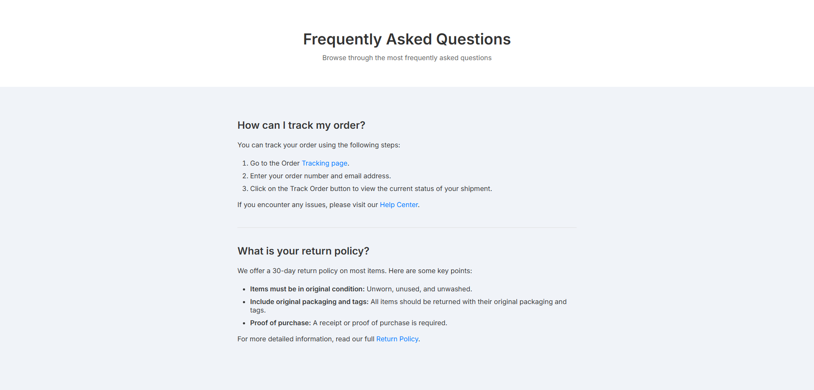

<!-- Please update value in the {}  -->

<h1 align="center">Simple-FAQ-Challenge | devChallenges</h1>

A solution for the challenge titled <a href="https://devchallenges.io/challenge/simple-faq-challenge" target="_blank">Simple Frequently Asked Questions (FAQ)</a> from <a 
href="https://devchallenges.io" 
target="_blank">devChallenges.io</a>

Submitted by Adam Ross DeStafeno

  <h3>
    <a href="https://ryuukae.github.io/simple-faq-page/src/index.html">
      Demo
    </a>
     | 
    <a href="https://www.github.com/Ryuukae/simple-faq-page">
      Solution
    </a>
     | 
    <a href="https://devchallenges.io/challenge/simple-faq-challenge">
      Challenge
    </a>
  </h3>

- - -

- - -
<!-- TABLE OF CONTENTS -->

## Table of Contents
- - 

- [Overview](#overview)
  - [Project Structure](#package-structure)
  - [What I learned](#what-i-learned)
  - [Useful resources](#useful-resources)
- [Features](#features)
  - [Built with](#built-with)
- [Author Credits](#author-credits) 
  - [Contact](#contact)
- [Acknowledgements](#acknowledgements)
                 
<!-- OVERVIEW -->

## Overview

- - -
    This project is a submission for the "Simple FAQ Challenge" provided by DevChallenges which showcases a generic responsive FAQ component to replicate.

    The solution leverages HTML5 and CSS3 to create a clean and interactive FAQ page. The implementation
emphasizes simplicity, reusability, and adherence to front-end development best practices, such as semantic HTML and modular CSS, which demonstrates a basic understanding of 
HTML/CSS and Modern Web Development practices, such as responsive web design principles for optimization across various devices and screen sizes.

Key highlights of this project include:

- A lightweight, visually appealing component designed for seamless integration into larger projects.
- A generic boilerplate for a FAQ page featuring an expandable and reusable template, easily customizable to create unique FAQ components.
- A responsive design that ensures optimal display on various devices.

### What I learned

- Improved understanding of responsive web design principles, particularly the use of media queries.
- Enhanced knowledge of semantic HTML structure for better accessibility and readability.
- Gained experience in creating reusable and modular CSS for maintainable code.

### Useful resources

- [Responsive Web Design Tips & Tricks](https://webflow.com/blog/responsive-web-design-tricks-and-tips) - Helpful tips regarding responsive web design.
- [MDN Core Learning Module: CSS Layers](https://developer.mozilla.org/en-US/docs/Learn_web_development/Core/CSS_layout) - A collection of useful articles on the 
  fundamentals of css layouts and responsive web-design.

## Features
- - -

- <i>A clean and minimalist design

- Accessibility considerations for better inclusivity    

   
- Responsive layout that adapts to different screen sizes</i>

### Project Structure
- - - _       
/  
├─ src/       
        ├── styles/  
                   └── styles.css         
        └─ resources/                                                      
                   └── Screenshot.jpg  
          └── index.html   
── README.md
     - - - - - |

### Built with
  - - - _

- <b>Markup Languages</b>
- - <i> HTML5</i>
- - <i>CSS3</i>
- - _
-  _ 
-   

## Author Credits

This <i><b>[repository](https://www.github.com/Ryuukae/simple-faq-page)</i></b> is...
- -[x] <i><b><u>Owned 
- - - [x] Written
- - - - [x] Maintained</u></b></i> 

- -
by <i><u><a href="https://www.linkedin.com/in/adam-ross-destafeno" style="color: white;">Adam Ross DeStafeno (Ryuukae)</a></u></i>
            
         

## Contact

   For any additional information or queries, you can reach out through:

[//]: # (- **Personal Website:** [your-website.com]&#40;https://{your-web-site-link}&#41;)

- **GitHub:**
  - <i><a href="https://github.com/Ryuukae" target="_blank">[@ryuukae](https://github.com/Ryuukae)</a></i>
  
- **LinkedIn:** 
   - <i><a href="https://www.linkedin.com/in/adam-ross-destafeno" target="_blank">[adam-ross-destafeno](https://www.linkedin.com/in/adam-ross-destafeno)</a></i>

- **Email:** 
  - <i><a class="copy-link" href="mailto:contact@adamrossdestafeno.dev" onclick="navigator.clipboard.writeText('contact@adamrossdestafeno.dev'); return false;">
  contact@adamrossdestafeno.dev</a></i>
  - <i><a href="mailto:contact@adamrossdestafeno.dev" onclick="navigator.clipboard.writeText('contact@adamrossdestafeno.dev'); return false;">
    ryuukae.dev@gmail.com</a></i>

## Acknowledgements

- <i>Many thanks to devChallenges.io for presenting thought-provoking and educational web development challenges.</i>
                            

- <i>Heartfelt appreciation to the devChallenges.io community for offering valuable feedback and insights.</i>

